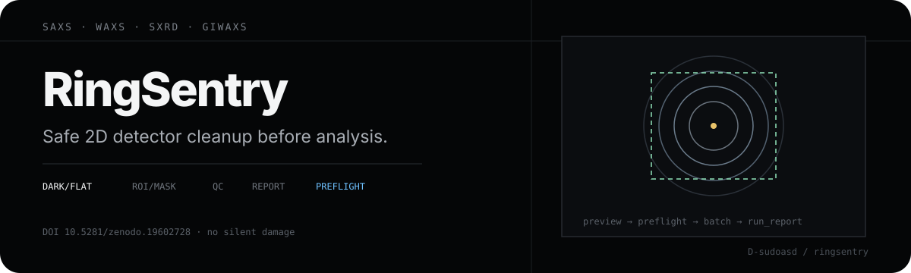
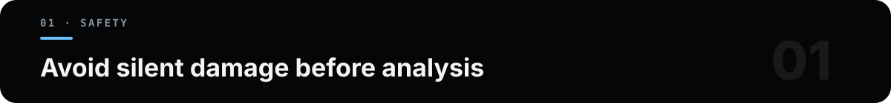
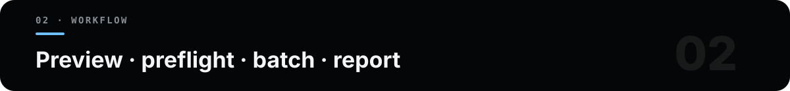

<p align="center">
  
</p>

<div align="center">

# RingSentry

**Reproducible preprocessing and quality control for 2D diffraction detector images**

SAXS · WAXS · SXRD · GIWAXS

[](LICENSE)
[](pyproject.toml)
[](https://doi.org/10.5281/zenodo.19602728)

</div>

RingSentry is a local desktop application and Python processing core for
inspectable preprocessing of two-dimensional diffraction detector images
before downstream integration, fitting, texture analysis, or other
quantitative interpretation. It combines multi-format input/output,
non-mutating quality-control suggestions, an explicitly ordered numerical
pipeline, previews, batch reports, a conservative CBF zero-value repair
workflow, and detector-geometry/Q conversion tools.

二维衍射图预处理：处理顺序、风险提示和参数进入日志与报告，避免静默改变数据含义。

## Why RingSentry

Detector data often arrive in instrument-specific formats and must be checked,
corrected, cropped, masked, transformed, and exported before analysis.
RingSentry makes that preparation path visible in one interface and keeps the
scientific data path separate from display-only exports.

RingSentry does **not** perform azimuthal integration, peak fitting, structure
refinement, or automatic physical interpretation. Its QC rules report
transparent numerical evidence and suggestions; they do not silently change
processing parameters.

<p align="center">
  
</p>

## Install

Use a virtual environment and install the project itself, not only its
dependency list.

### Windows PowerShell

```powershell
py -3.12 -m venv .venv
.\.venv\Scripts\Activate.ps1
python -m pip install --upgrade pip
python -m pip install .
ringsentry
```

The bundled `START_RingSentry.cmd`, `START_RingSentry.bat`, and
`双击启动_RingSentry.cmd` launchers are also available for Windows.

### macOS or Linux

```bash
python3 -m venv .venv
source .venv/bin/activate
python -m pip install --upgrade pip
python -m pip install .
ringsentry
```

The GUI requires Tk. Some Linux distributions package this separately (for
example, `python3-tk`). The current maintainer workflow is primarily validated
on Windows; use the headless example below to verify the numerical core on
another platform.

For development or review:

```bash
python -m pip install -e ".[test]"
python -m ruff check .
python -m pytest -q
python -m build
```

## Quick start

<p align="center">
  
</p>

1. Select an input directory recursively or choose individual files.
2. Select an output directory; the GUI otherwise proposes `_converted`.
3. Choose **统计文件** and run **自动质控 / 分析样本**.
4. Use the coordinate preview to select an ROI, then use **单图模式 (Single
   image)** to inspect the same complete numerical pipeline that batch
   processing applies.
   When PNG output is selected, the single-image view also applies its display
   rendering options.
5. Select quantitative matrix outputs (EDF or NPY are the safest defaults) or
   display/text outputs as needed.
6. Choose **开始转换**, review the preflight messages, and inspect the generated
   `run_report_*.txt`.

Preflight quality control samples at most five input files. During conversion,
the worker emits per-file QC and writer messages for files it can load; the GUI
copies those messages and the selected processing/output settings into the run
report. The report is provenance for the run, not proof that every warning has
been resolved.

The numerical order is fixed and documented: dark subtraction → flat
correction → background offset → ROI → mask → absolute and percentile
clipping → negative clipping → hot-pixel suppression → rotation/flips →
binning → intensity transform → gamma → normalization.

## Reproducible headless example

This example generates its own deterministic synthetic ring image. It is not
an experimental result or a performance benchmark.

```bash
python examples/minimal_preprocessing.py --output-dir example_output
```

Expected checks include a `128 × 128` finite input, a `64 × 64` finite
processed array after 2× binning, and these outputs:

- `synthetic_raw.npy` and `synthetic_processed.npy`: quantitative arrays;
- `synthetic_processed_display.png`: display-only rendering;
- `summary.json`: seed, processing options, QC facts, shapes, ranges, and
  output provenance.

## Supported data

| Implemented input path | Reader and current validation scope |
|---|---|
| TIFF (`.tif`, `.tiff`) | tifffile/imageio; repository fixtures and round-trip tests exercise TIFF files |
| MCCD, MARCCD | Routed through the TIFF-family reader by header or suffix; no dedicated MCCD/MARCCD fixture is included |
| HDF5 and NeXus | h5py with a configurable dataset path; callers must select a single 2D dataset |
| EDF | Strict uncompressed 2D reader; project and FabIO interoperability tests exercise supported files |
| CBF | FabIO, exercised by repository round-trip and exceptional-value tests |
| ADSC/Bruker IMG, MAR3450, SFRM | FabIO reader routes are implemented; detector-specific sample compatibility is not yet covered by repository fixtures |

| Output | Intended use |
|---|---|
| EDF, NPY | Quantitative matrix preservation |
| TIFF | Scientific-image interoperability; CBF integer dtype conversion is logged |
| CSV/DAT matrix or x-y-intensity columns | Text-based interchange; retain the GUI run report for XY option provenance |
| PNG | Display and rapid inspection only, never the quantitative matrix |

## Safety boundaries

- CBF overexposure repair can replace stored zero values with a configured
  saturation-like value only after the user confirms the acquisition
  convention. Zero may instead represent a beamstop, module gap, mask, or
  genuine low count. A formal GUI repair requires a rule-evidence note, writes
  a separate copy, and requires read-back verification; the GUI rejects
  original-file overwrite. The lower-level API also rejects original overwrite;
  disabled verification remains an explicit escape hatch, and output written
  without verification is marked `repaired_unverified`. SHA-256 fields are populated
  only when `compute_sha256` is enabled. The tool cannot recover lost
  intensity.
- Validation indexes record SHA-256-linked original/output pairs as advisory
  evidence, but they never authorize automatic removal. RingSentry reports
  cleanup candidates and leaves archival or deletion to a separate,
  user-controlled process after independent review.
- Duplicate-name CBF candidates are likewise reported by name, size, and
  SHA-256 evidence; RingSentry does not move them automatically.
- Flat correction expects a relative detector-response map. RingSentry does
  not automatically normalize raw flat counts, so users requiring
  scale-preserving correction must normalize that map before processing.
- A mask may set invalid pixels to `NaN`. Floating-point NPY, EDF, and TIFF
  preserve IEEE `NaN`/`Inf`; CSV/DAT matrix exports replace them with zero
  and log separate counts. Third-party TIFF viewers may display non-finite
  pixels differently.
- Binning uses block means and crops non-divisible right/bottom edges.
- Percentile clipping, intensity transforms, gamma correction, and
  normalization alter numerical meaning and should be enabled only when
  scientifically justified.
- PNG is an 8-bit RGB view; use EDF or NPY for quantitative downstream work.

## Documentation

- [User guide](docs/USER_GUIDE.md): installation, complete GUI workflow,
  formats, processing semantics, CBF repair, Q tools, and troubleshooting.
- [Core API](docs/CORE_API.md): programmatic loading, QC, processing, writing,
  and diffraction-geometry interfaces.
- [Contributing](CONTRIBUTING.md), [Code of Conduct](CODE_OF_CONDUCT.md), and
  [security policy](SECURITY.md).
- [JOSS paper source](paper/paper.md).

## Version and citation

The source tree identifies itself as `7.0.0`. The latest public Git tag,
GitHub Release, and version-specific Zenodo archive are currently `v6.0.1`;
the concept DOI `10.5281/zenodo.19602728` resolves to that latest archived
version until a new release is published. Do not describe `v7.0.0` as an
archived release until its tag, release, and Zenodo record exist.

Use [`CITATION.cff`](CITATION.cff) for the maintained author and software
metadata. For reproducibility, cite the exact version-specific archive DOI
once the version used in the analysis has been released.

## Support and governance

Use [GitHub Issues](https://github.com/D-sudoasd/ringsentry/issues) for
reproducible bugs, focused feature proposals, and general usage questions.
Follow [`SECURITY.md`](SECURITY.md) for vulnerabilities and avoid uploading
private beamline data. RingSentry is currently maintained as a single-maintainer
research project; decisions prioritize numerical transparency, regression
tests, documented data semantics, and backward compatibility. Maintenance and
support are provided on a best-effort basis.

## License

RingSentry is released under the [MIT License](LICENSE).
